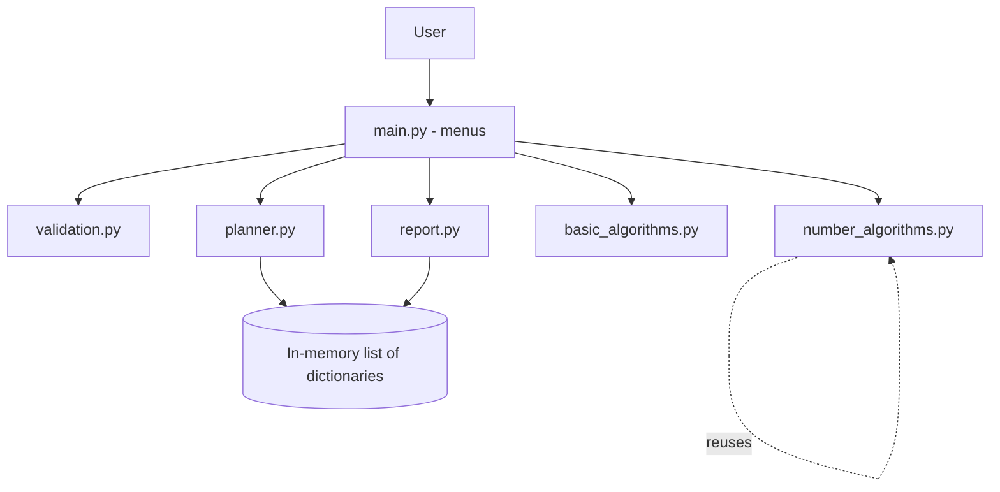
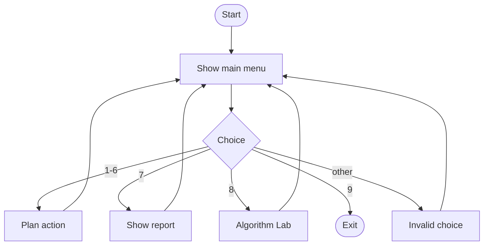
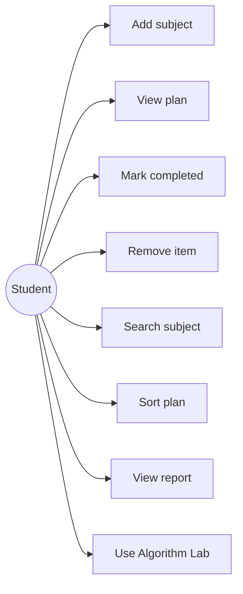
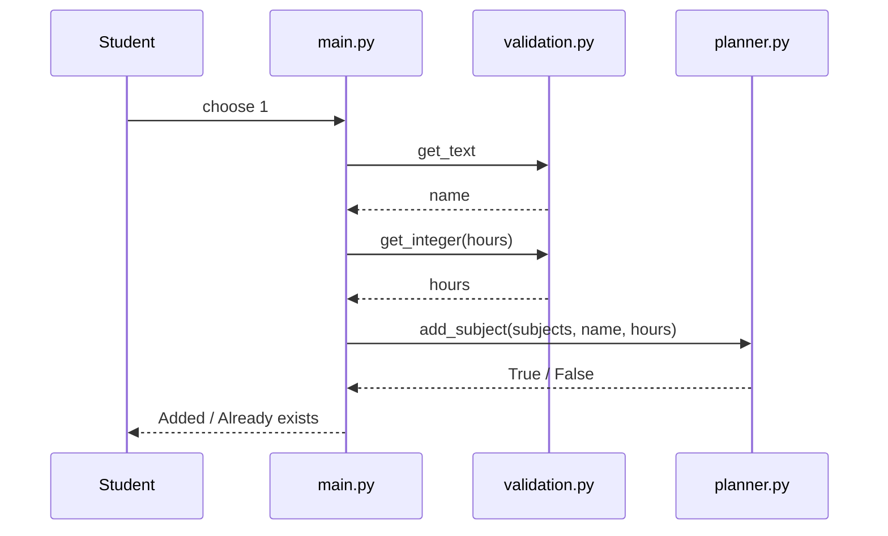
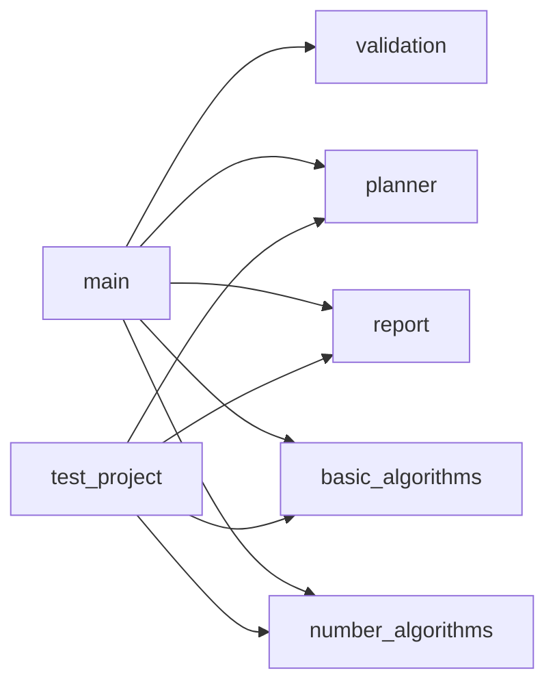

# Design Document

## 1. Problem Statement
Students find it hard to organise study hours and practise basic algorithms in one place. See `statement.md`.

## 2. Objectives
1. Let a student build and manage a study plan.
2. Show progress through a simple report.
3. Provide an Algorithm Lab that applies the fundamental algorithms of the course.
4. Keep the program modular, validated and tested.

## 3. Functional Requirements
| ID | Requirement |
|---|---|
| FR1 | Add a subject with study hours (no duplicates). |
| FR2 | View, mark completed, remove, search and sort the plan. |
| FR3 | Generate a report (counts, hours, percentage). |
| FR4 | Run 9 algorithms from the Algorithm Lab on user input. |
| FR5 | Show clear menus and messages for every action. |

The three major modules are **Study Plan Management**, **Report** and **Algorithm Lab**.

## 4. Non-Functional Requirements
| Type | Requirement |
|---|---|
| Usability | Numbered menus and clear prompts stating the allowed range. |
| Reliability | Every input is validated and re-asked; the program never crashes on bad input. |
| Maintainability | One responsibility per module; comments on every function. |
| Performance / resource efficiency | Trial division stops at the square root (time trade-off); input limits keep run time short. |
| Error handling | Invalid choices and item numbers give a message and the menu continues. |

## 5. System Architecture


## 6. Workflow Diagram


## 7. Use Case Diagram


## 8. Sequence Diagram (Add Subject)


## 9. Component Diagram


## 10. Storage Design
No database is used. The plan is kept in memory as a list of dictionaries:
```
subjects = [ {'name': 'Maths', 'hours': 3, 'done': False}, ... ]
```
An ER diagram is therefore not applicable.

## 11. Design Decisions
- **List of dictionaries:** each subject has named fields, and the list keeps the order shown to the user.
- **Functions in separate modules:** easier to test and explain.
- **Loop-based validation:** `isdecimal()` check with a `while` loop instead of exceptions.
- **Newton's method for square root:** converges in a few steps; the loop stops when two guesses are almost equal.
- **Divisors only up to the square root:** cuts the work from n steps to about the square root of n.
